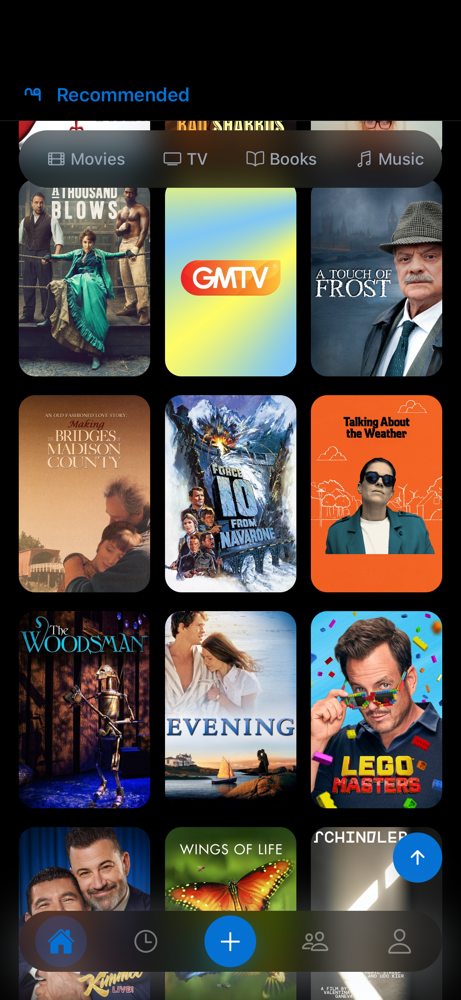
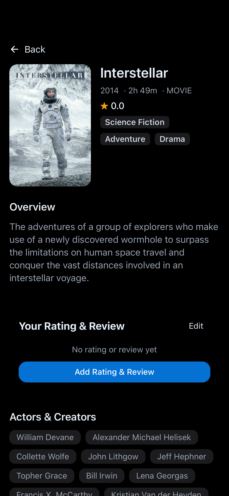
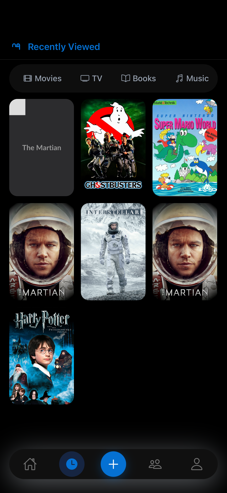
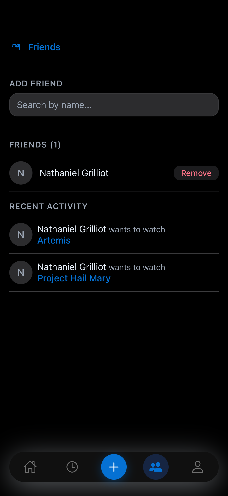
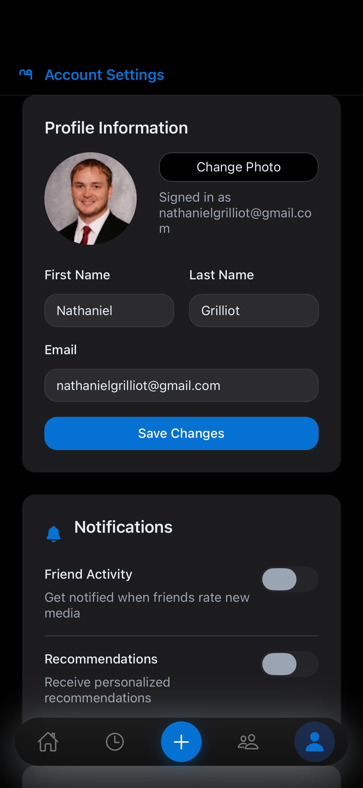
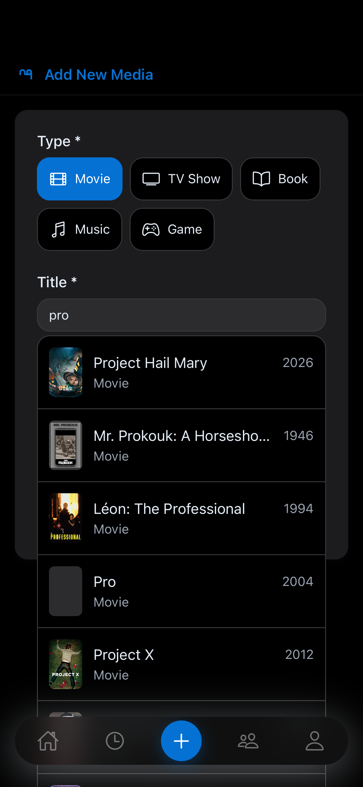

# User Interface Specification

## Design System

- **Framework:** React Native with Expo
- **Styling:** StyleSheet.create with token-based design system
- **Navigation:** Expo Router (tab-based)

### Design Tokens

See `frontend/src/components/ui/tokens.ts` for the complete design token definitions including colors, spacing, border radii, and typography.

## Screen Specifications

### Home Screen

The home screen displays a scrollable grid of recommended media cover art in a 3-column layout. A floating, horizontally scrollable pill bar at the top allows filtering by media type (Movies, TV, Books, Music, Games). Each cover card is pressable with haptic feedback and navigates to the media detail screen. The screen supports pull-to-refresh, infinite scroll pagination, and a scroll-to-top FAB that appears after scrolling. Skeleton placeholders are shown during loading.



### Media Detail Screen

The detail screen shows full media information. The hero section displays a cover image alongside the title, year, duration, type, star rating, and genre badges. Below is an overview section with the description. A "Track this item" button opens a bottom sheet modal for selecting a status (Planned, In Progress, Completed). Once tracked, a User Activity section appears for rating (0-5 stars in 0.5 increments), reviewing (max 140 characters), and updating status. The screen also shows Actors & Creators as pill-shaped chips and a horizontally scrolling Related section.



### History Screen

The history screen shows all user-tracked media in a 3-column grid of cover art, similar to the home screen. It includes the same floating media type filter bar. The most recently added item displays a shimmer overlay while the backend performs recursive data enrichment. The screen polls every 4 seconds to check enrichment status and refreshes automatically when complete. Supports pull-to-refresh and shows an empty state message when no history exists.



### Friends Screen

The friends screen has several sections. At the top is a search bar for finding users by name with autocomplete suggestions. Pending incoming requests show Accept/Decline buttons, while sent requests show a Pending label. The friends list displays each friend's avatar (initial-based circle) and name with a Remove button. A Recent Activity feed shows friends' tracked media with status verbs (finished, started, dropped, etc.), each linking to the media detail screen. The entire screen supports pull-to-refresh.



### Account Screen

The account screen is divided into cards. The Profile Information card shows a large avatar, a "Change Photo" button, and editable form fields for first name, last name, and email with a Save Changes button. The Notifications card contains toggle switches for Friend Activity and Recommendations notifications. The Appearance card offers Light, Dark, and Auto theme selection buttons. Account Management provides options to switch or add accounts and log out. A Danger Zone card at the bottom contains a red-styled Delete Account link.



### Add Media Screen

The add screen presents a form inside a keyboard-avoiding view. Users first select a media type (Movie, TV Show, Book, Music, Game) from pill-shaped toggles. Once selected, a Title input with autocomplete search suggestions appears, along with an optional Year input. An expandable Rate & Review section offers a star rating component, a 140-character review text input (inspired by Twitter), and a status picker (Planned, In Progress, Completed). Submitting navigates to the History screen on success.



## Navigation Flow

```
Tab Navigator
├── Home
├── History
├── Add Media
├── Friends
└── Account
```
